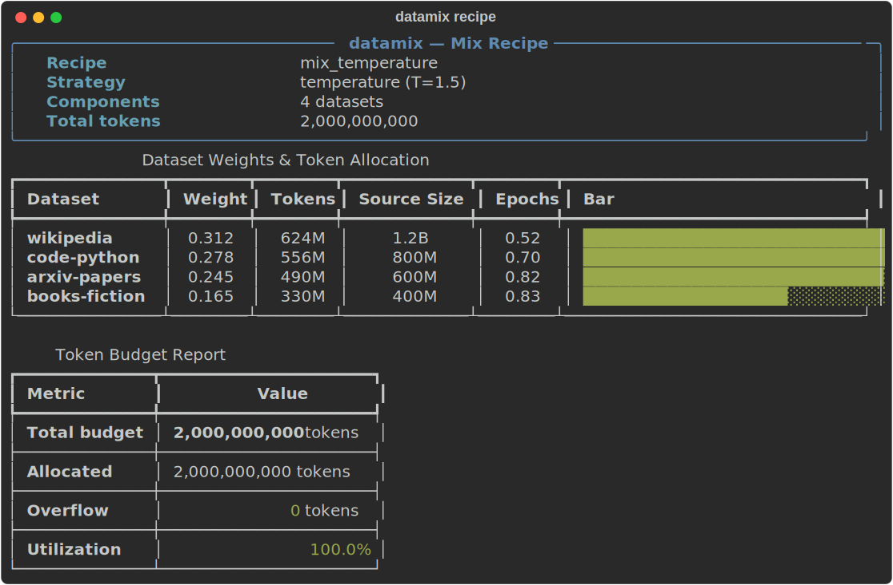
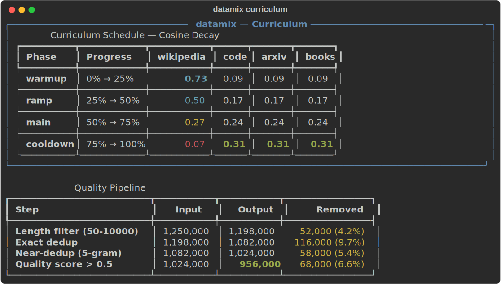

# datamix

[](https://github.com/stef41/datamix/actions/workflows/ci.yml)
[](https://www.python.org/downloads/)
[](LICENSE)

**Dataset mixing & curriculum optimizer for LLM training.** Profile datasets, create mix recipes, schedule curricula, allocate token budgets, and clean data — all with zero dependencies.

Training data composition is one of the most impactful decisions in LLM training, yet there's no standard tooling for it. datamix gives you a programmatic way to profile, blend, schedule, and budget your training data.

<p align="center">
  
</p>

## Why datamix?

| Problem | datamix Solution |
|---|---|
| "What ratio of code vs. wiki should I use?" | Temperature-scaled mixing with automatic weight computation |
| No way to profile datasets before mixing | Instant profiling — token counts, lengths, quality metrics |
| Data curriculum is done manually in configs | Programmatic scheduling — linear, cosine, step functions |
| Token budget allocation is guesswork | Automatic budget computation with overflow detection |
| Quality filtering is scattered scripts | Built-in length filter, exact/near dedup, quality scoring |

## Installation

```bash
pip install datamix            # zero dependencies
pip install datamix[cli]       # + click, rich for terminal UI
pip install datamix[all]       # everything
```

## Quick Start

### 1. Profile your datasets

```python
from datamix import profile_dataset, profile_jsonl, compare_profiles

# From a JSONL file
wiki = profile_jsonl("data/wikipedia.jsonl")
code = profile_jsonl("data/code-python.jsonl")

print(f"{wiki.name}: {wiki.n_examples:,} examples, {wiki.size_tokens_m:.1f}M tokens")
print(f"{code.name}: {code.n_examples:,} examples, {code.size_tokens_m:.1f}M tokens")

# Compare multiple datasets
comparison = compare_profiles([wiki, code])
print(f"Total: {comparison['total_tokens']:,} tokens across {comparison['n_datasets']} datasets")
```

### 2. Create a mix recipe

```python
from datamix import create_recipe, MixStrategy

recipe = create_recipe(
    [wiki, code],
    strategy=MixStrategy.TEMPERATURE,
    temperature=1.5,  # >1 = more uniform, <1 = proportional
    total_tokens=2_000_000_000,
)

for name, weight in recipe.normalized_weights.items():
    print(f"  {name}: {weight:.1%}")
```

### 3. Schedule a curriculum

<p align="center">
  
</p>

```python
from datamix import cosine_schedule, linear_schedule

# Cosine decay: primary dataset starts high, others increase
sched = cosine_schedule(
    ["wikipedia", "code", "arxiv", "books"],
    n_phases=4,
    primary="wikipedia",
    total_tokens=2_000_000_000,
)

# Get weights at any training progress point
weights_start = sched.weights_at(0.0)   # {"wikipedia": 0.93, ...}
weights_mid = sched.weights_at(0.5)     # {"wikipedia": 0.50, ...}
weights_end = sched.weights_at(1.0)     # {"wikipedia": 0.07, ...}
```

### 4. Allocate token budgets

```python
from datamix import compute_budget, fit_to_budget, budget_report

# From a recipe
budget = compute_budget(recipe, [wiki, code])
print(budget_report(budget))

# Or fit datasets to a fixed budget
budget = fit_to_budget([wiki, code], token_budget=1_000_000_000)
```

### 5. Clean your data

```python
from datamix import length_filter, dedup_exact, dedup_ngram, quality_score

# Filter by length
kept, stats = length_filter(texts, min_length=50, max_length=10000)
print(f"Kept {stats['kept']}, removed {stats['removed']}")

# Remove exact duplicates
kept, stats = dedup_exact(kept)

# Remove near-duplicates (n-gram Jaccard)
kept, stats = dedup_ngram(kept, n=5, threshold=0.8)

# Score individual examples
for text in kept[:5]:
    score = quality_score(text)
    print(f"  {score:.2f}  {text[:60]}...")
```

## CLI

```bash
# Profile a JSONL file
datamix profile data/wiki.jsonl

# Create a mix recipe
datamix mix data/wiki.jsonl data/code.jsonl --strategy temperature --budget 2000000000

# Clean a dataset
datamix clean data/raw.jsonl --min-length 50 --dedup
```

## Mixing Strategies

| Strategy | Description | When to Use |
|---|---|---|
| `PROPORTIONAL` | Weight by dataset size | Default — larger datasets get more weight |
| `TEMPERATURE` | Temperature-scaled proportional | Control uniformity (T>1) vs. proportional (T<1) |
| `EQUAL` | Equal weight per dataset | When all datasets are equally important |
| `CUSTOM` | Explicit weights | When you know the exact ratios |

## Curriculum Types

| Schedule | Description |
|---|---|
| `linear_schedule` | Linear interpolation from start to end weights |
| `cosine_schedule` | Cosine decay for primary dataset, others increase |
| `step_schedule` | Step function with explicit phase configs |
| `custom_schedule` | Build from CurriculumPhase objects |

## Architecture

```
datamix/
├── _types.py        # DatasetProfile, MixRecipe, CurriculumSchedule, TokenBudget
├── profile.py       # Dataset profiling from lists or JSONL files
├── mixer.py         # Mix recipe creation, merging, scaling
├── curriculum.py    # Linear, cosine, step, custom curriculum schedules
├── sampler.py       # Temperature, proportional, stratified sampling
├── budget.py        # Token budget computation and allocation
├── quality.py       # Length filter, exact/near dedup, quality scoring
└── cli.py           # Click CLI interface
```

## See Also

Part of the **stef41 LLM toolkit** — open-source tools for every stage of the LLM lifecycle:

| Project | What it does |
|---------|-------------|
| [tokonomics](https://github.com/stef41/tokonomix) | Token counting & cost management for LLM APIs |
| [datacrux](https://github.com/stef41/datacruxai) | Training data quality — dedup, PII, contamination |
| [castwright](https://github.com/stef41/castwright) | Synthetic instruction data generation |
| [toksight](https://github.com/stef41/toksight) | Tokenizer analysis & comparison |
| [trainpulse](https://github.com/stef41/trainpulse) | Training health monitoring |
| [ckpt](https://github.com/stef41/ckptkit) | Checkpoint inspection, diffing & merging |
| [quantbench](https://github.com/stef41/quantbenchx) | Quantization quality analysis |
| [infermark](https://github.com/stef41/infermark) | Inference benchmarking |
| [modeldiff](https://github.com/stef41/modeldiffx) | Behavioral regression testing |
| [vibesafe](https://github.com/stef41/vibesafex) | AI-generated code safety scanner |
| [injectionguard](https://github.com/stef41/injectionguard) | Prompt injection detection |

## License

Apache 2.0
